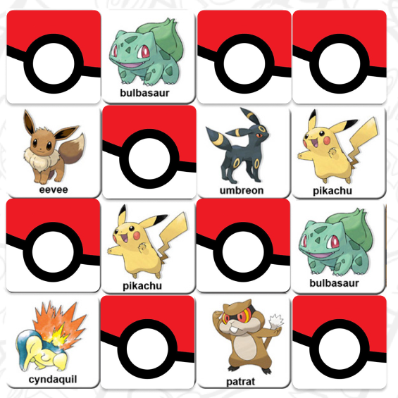

# Memory Match Game: edición Memory pokémon

## Indice

* [1. Introducción al proyecto](#1-introducción-al-proyecto)
* [2. A qué usuario se dirige el juego](#2-a-qué-usuario-se-dirige-el-juego)
* [3. Prototipo del proyecto](#6-prototípo-del-proyecto)
* [4. Instrucciones de uso](#3-instrucciones-de-uso)
* [5. Dónde encontrar la página](#4-dónde-encontrar-la-página)
* [6. Herramientas que se utilizaron para realizar el proyecto](#5-herramientas-que-se-utilizaron-para-realizar-el-proyecto)

***

## 1. Introducción al proyecto

**Memory Pokémon** es una página enfocada en el mundo de *pokémon*. En este proyecto, encontrarás un pantalla principal donde, podrás poner tu nombre, elegir un entrenador y entrar al juego *memorice*. Este juego consta de  cartas dise{adas con el tema de una **pokeball**, la cual al hacer "click" sobre ella, se volteará y aparecerá un pokémon ¡ Debes buscar su dupla y obtener la mejor puntuación !. También, contrarás una breve pokédex donde se muestra la imágen de cada uno de los pokémon que están presentes en el juego del *memory match game*.

## 2. A qué usuario se dirige el juego

El usuario al cuál va dirigido nuestro proyecto, comprende dentro del rango de los 24 años, donde el mayor interesado por el tema es el género **masculino**. En general, el usuario se encarga de trabajar y estudiar, tiene como pasatiempo *juegar en línea y ver anime*. Es por ello que, al momento de realizar el testeo, se pudo identificar que la necesidad de este usuario era el gusto por el juego **memory match** pero la falta de aplicaciónes o páginas web que pudieran satisfacer los gustos de este. 

!

## 3. Portotipo del proyecto

En el siguiente link podrás encontrar el prototipo del proyecto en forma digital, el cual se basó en las necesidades del usuario al momento de realizar las encuestas y entrevistas pertinentes.

[Prototipo realizado en figma para el proyecto 2 de laboratoria](https://www.figma.com/proto/yCaf78tPwgyVPyRsa2maFC/Proyecto-2%3A-Memory-match%2C-pok%C3%A9mon-prototipo-final?node-id=49%3A18&scaling=scale-down&page-id=0%3A1).

## 4. Instrucciones de uso

El entrar a la página, encontrarás una pantalla principal donde se dará la bienvenida y te pedirá que ingreses tu nombre de usuario y luego apretes el botón de **Misty** o **Ash** para comenzar a jugar. En la siguiente pégina, se mostrará el juego *memory match* donde saldrá tu nombre de usuario, el puntaje base y el entrenador que seleccionaste. Tendrás que hacer click en las cartas para encontrar cada par de imágenes de los pokémon correspondientes. Al final, si aciertas todas, obtendrás el puntaje máximo del juego (si quieres volver a jugar solo refresca la página!). Al terminar el juego, tendrás la opción de jugar de nuevo o revisar la pestaña *pokédex* para ver cuáles son los pokémon que aparecen en el juego anterior.

## 5. Dónde encontrar la página

Podrás encontrar la página directamente desde estos enlaces:

* [Proyecto Marjorie L.](https://github.com/majolagos/SCL016-memory-match-game).
* [Proyecto Sofia B.](https://github.com/SofiBenavente/SCL016-memory-match-game).

O bien, en el siguiente link directo: [MemoryPokémon](https://majolagos.github.io/SCL016-memory-match-game/src/index.html).

## 6. Herramientas que se utilizaron para realizar el proyecto

* CSS
* Html
* JavaScript
* Node.js (para hacer pruebas en npm)
* GitBash
* PowerShell

